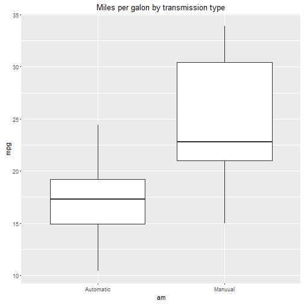

## Motor Trend Car Road Test Explorer

The data is part of the R datasets
The data was extracted from the 1974 Motor Trend US magazine, and comprises fuel consumption and 10 aspects of automobile design and performance for 32 automobiles (1973-74 models).

The app can be found here: https://schigrinov.shinyapps.io/DevelopDataProductCoursework/
Code can be found on github: https://github.com/schigrinov/DevelopDataProductCoursework

## Application description

On the main tab, called Explore the Data, application visualises the mtcars dataset. The graph on the Visualization page shows scatterplot for fuel consumption for different cars in the dataset. Data window shows the tabular data. You can filter the data by two parameters - number of cilinders and gross horsepower using slider inputs on the left side.


--- .class #id 

## Raw data

See the top raws of the raw data: 


```r
data("mtcars")
head(mtcars)
```

```
##                    mpg cyl disp  hp drat    wt  qsec vs am gear carb
## Mazda RX4         21.0   6  160 110 3.90 2.620 16.46  0  1    4    4
## Mazda RX4 Wag     21.0   6  160 110 3.90 2.875 17.02  0  1    4    4
## Datsun 710        22.8   4  108  93 3.85 2.320 18.61  1  1    4    1
## Hornet 4 Drive    21.4   6  258 110 3.08 3.215 19.44  1  0    3    1
## Hornet Sportabout 18.7   8  360 175 3.15 3.440 17.02  0  0    3    2
## Valiant           18.1   6  225 105 2.76 3.460 20.22  1  0    3    1
```

---
## Visualization

```r
suppressWarnings(library(ggplot2));mtcars$am<-factor(mtcars$am);levels(mtcars$am)<-c("Automatic","Manuual")
ggplot(mtcars, aes(am, mpg)) + geom_boxplot() + ggtitle("Miles per galon by transmission type")
```



---

## Thanks for your attention! 
## Hope to get a good mark from you!

